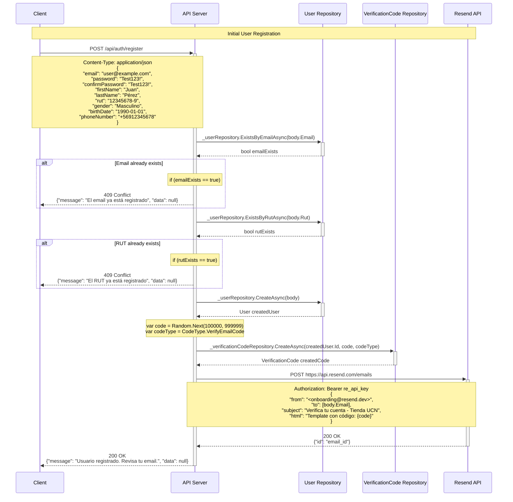

```mermaid
sequenceDiagram
    participant C as Client
    participant API as API Server
    participant UR as User Repository
    participant VCR as VerificationCode Repository
    participant RS as Resend API

    Note over C,RS: Initial User Registration

    C->>+API: POST /api/auth/register
    Note over C,API: Content-Type: application/json<br/>{<br/>"email": "user@example.com",<br/>"password": "Test123!",<br/>"confirmPassword": "Test123!",<br/>"firstName": "Juan",<br/>"lastName": "Pérez",<br/>"rut": "12345678-9",<br/>"gender": "Masculino",<br/>"birthDate": "1990-01-01",<br/>"phoneNumber": "+56912345678"<br/>}

    API->>+UR: _userRepository.ExistsByEmailAsync(body.Email)
    UR-->>-API: bool emailExists

    alt Email already exists
        Note over API: if (emailExists == true)
        API-->>C: 409 Conflict<br/>{"message": "El email ya está registrado", "data": null}
    end

    API->>+UR: _userRepository.ExistsByRutAsync(body.Rut)
    UR-->>-API: bool rutExists


    alt RUT already exists
        Note over API: if (rutExists == true)
        API-->>C: 409 Conflict<br/>{"message": "El RUT ya está registrado", "data": null}
    end

    API->>+UR: _userRepository.CreateAsync(body)
    UR-->>-API: User createdUser

    Note over API: var code = Random.Next(100000, 999999)<br/>var codeType = CodeType.VerifyEmailCode

    API->>+VCR: _verificationCodeRepository.CreateAsync(createdUser.Id, code, codeType)
    VCR-->>-API: VerificationCode createdCode

    API->>+RS: POST https://api.resend.com/emails
    Note over API,RS: Authorization: Bearer re_api_key<br/>{<br/>"from": "<onboarding@resend.dev>",<br/>"to": [body.Email],<br/>"subject": "Verifica tu cuenta - Tienda UCN",<br/>"html": "Template con código: {code}"<br/>}

    RS-->>-API: 200 OK<br/>{"id": "email_id"}

    API-->>-C: 200 OK<br/>{"message": "Usuario registrado. Revisa tu email.", "data": null}
```