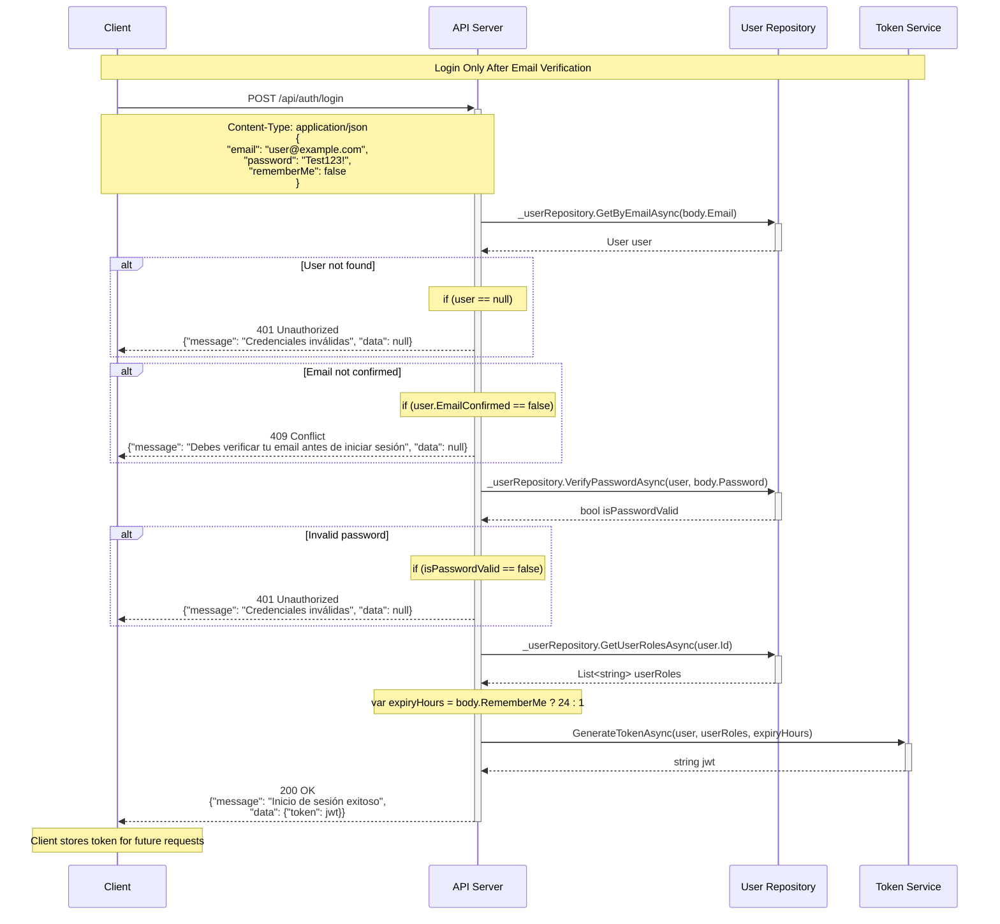

```mermaid
sequenceDiagram
    participant C as Client
    participant API as API Server
    participant UR as User Repository
    participant JWT as Token Service

    Note over C,JWT: Login Only After Email Verification

    C->>+API: POST /api/auth/login
    Note over C,API: Content-Type: application/json<br/>{<br/>"email": "user@example.com",<br/>"password": "Test123!",<br/>"rememberMe": false<br/>}

    API->>+UR: _userRepository.GetByEmailAsync(body.Email)
    UR-->>-API: User user

    alt User not found
        Note over API: if (user == null)
        API-->>C: 401 Unauthorized<br/>{"message": "Credenciales inválidas", "data": null}
    end

    alt Email not confirmed
        Note over API: if (user.EmailConfirmed == false)

        API-->>C: 409 Conflict<br/>{"message": "Debes verificar tu email antes de iniciar sesión", "data": null}
    end

    API->>+UR: _userRepository.VerifyPasswordAsync(user, body.Password)
    UR-->>-API: bool isPasswordValid

    alt Invalid password
        Note over API: if (isPasswordValid == false)
        API-->>C: 401 Unauthorized<br/>{"message": "Credenciales inválidas", "data": null}
    end

    API->>+UR: _userRepository.GetUserRolesAsync(user.Id)
    UR-->>-API: List<string> userRoles

    Note over API: var expiryHours = body.RememberMe ? 24 : 1

    API->>+JWT: GenerateTokenAsync(user, userRoles, expiryHours)
    JWT-->>-API: string jwt

    API-->>-C: 200 OK<br/>{"message": "Inicio de sesión exitoso",<br/>"data": {"token": jwt}}

    Note over C: Client stores token for future requests
```