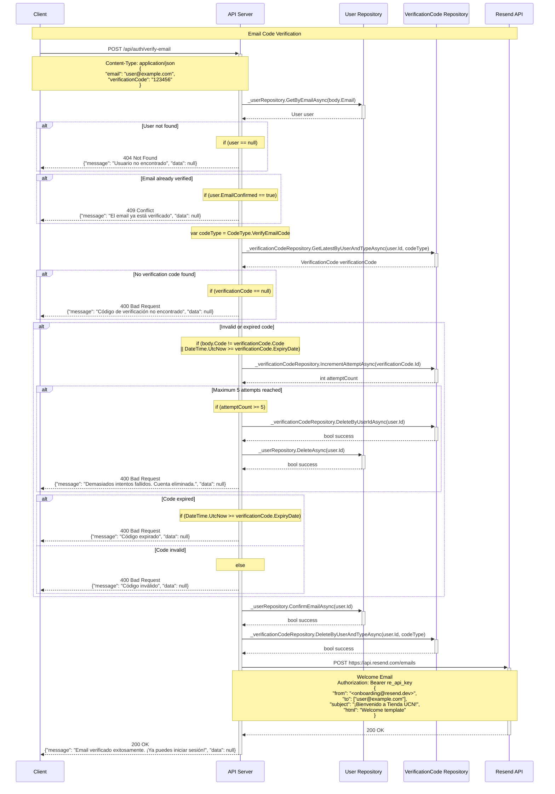

```mermaid
sequenceDiagram
    participant C as Client
    participant API as API Server
    participant UR as User Repository
    participant VCR as VerificationCode Repository
    participant RS as Resend API

    Note over C,RS: Email Code Verification

    C->>+API: POST /api/auth/verify-email
    Note over C,API: Content-Type: application/json<br/>{<br/>"email": "user@example.com",<br/>"verificationCode": "123456"<br/>}

    API->>+UR: _userRepository.GetByEmailAsync(body.Email)
    UR-->>-API: User user

    alt User not found
        Note over API: if (user == null)
        API-->>C: 404 Not Found<br/>{"message": "Usuario no encontrado", "data": null}
    end

    alt Email already verified
        Note over API: if (user.EmailConfirmed == true)
        API-->>C: 409 Conflict<br/>{"message": "El email ya está verificado", "data": null}
    end

    Note over API: var codeType = CodeType.VerifyEmailCode

    API->>+VCR: _verificationCodeRepository.GetLatestByUserAndTypeAsync(user.Id, codeType)
    VCR-->>-API: VerificationCode verificationCode

    alt No verification code found
        Note over API: if (verificationCode == null)
        API-->>C: 400 Bad Request<br/>{"message": "Código de verificación no encontrado", "data": null}
    end

    alt Invalid or expired code
        Note over API: if (body.Code != verificationCode.Code<br/>|| DateTime.UtcNow >= verificationCode.ExpiryDate)
        API->>+VCR: _verificationCodeRepository.IncrementAttemptAsync(verificationCode.Id)
        VCR-->>-API: int attemptCount

        alt Maximum 5 attempts reached
            Note over API: if (attemptCount >= 5)

            API->>+VCR: _verificationCodeRepository.DeleteByUserIdAsync(user.Id)
            VCR-->>-API: bool success

            API->>+UR: _userRepository.DeleteAsync(user.Id)
            UR-->>-API: bool success

            API-->>C: 400 Bad Request<br/>{"message": "Demasiados intentos fallidos. Cuenta eliminada.", "data": null}
        end

        alt Code expired
            Note over API: if (DateTime.UtcNow >= verificationCode.ExpiryDate)
            API-->>C: 400 Bad Request<br/>{"message": "Código expirado", "data": null}
        else Code invalid
            Note over API: else
            API-->>C: 400 Bad Request<br/>{"message": "Código inválido", "data": null}
        end
    end

    API->>+UR: _userRepository.ConfirmEmailAsync(user.Id)
    UR-->>-API: bool success

    API->>+VCR: _verificationCodeRepository.DeleteByUserAndTypeAsync(user.Id, codeType)
    VCR-->>-API: bool success

    API->>+RS: POST https://api.resend.com/emails
    Note over API,RS: Welcome Email<br/>Authorization: Bearer re_api_key<br/>{<br/>"from": "<onboarding@resend.dev>",<br/>"to": ["user@example.com"],<br/>"subject": "¡Bienvenido a Tienda UCN!",<br/>"html": "Welcome template"<br/>}

    RS-->>-API: 200 OK

    API-->>-C: 200 OK<br/>{"message": "Email verificado exitosamente. ¡Ya puedes iniciar sesión!", "data": null}
```